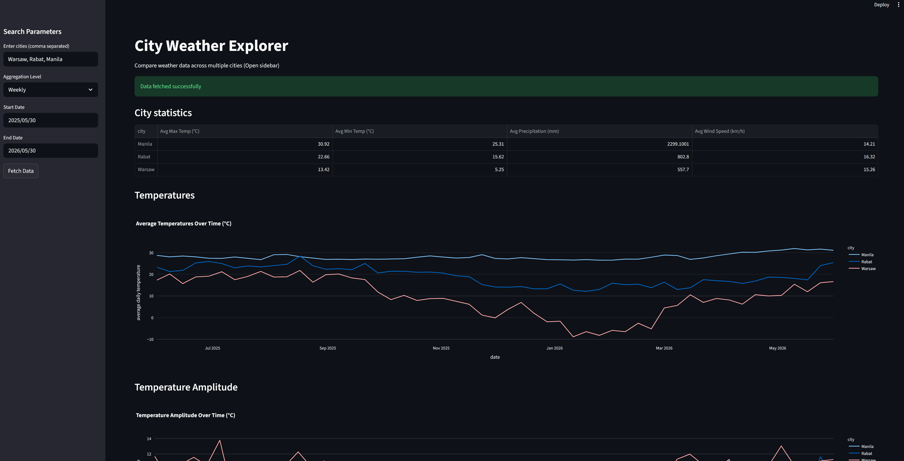
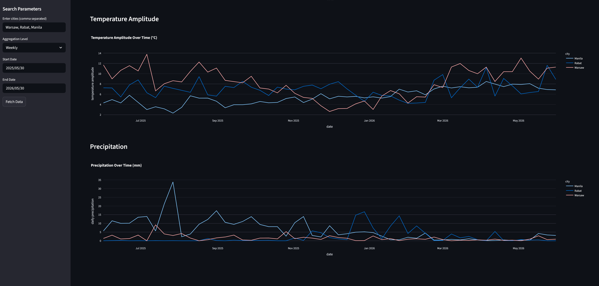

# Weather Data Visualizer (Python + Streamlit)
Author: Stanisław Kamiński

# Overview
This project aims to create an application providing visualization of changes in weather across cities specified by 
the user in a timeline based on user's choice, allowing comparison of data and aggregating some of the key metrics. 
This project uses Open Meteo API to gather weather data.

# Tech Stack
* Python (Pandas, Plotly)
* Streamlit
* Open-Meteo API

# Features
* Multi-city weather comparison
* User choice based interactive data visualization
* Temperature, amplitudes , precipitation and wind data
* Cached API requests

# Preview



# How to run:


1. Clone the repository

```bash
git clone https://github.com/GreenMateracci/weather-data-dashboard.git
cd weather-data-dashboard
```

2. Install dependencies

```bash
pip install -r requirements.txt
```

3. Run the application

```bash
streamlit run app.py
```